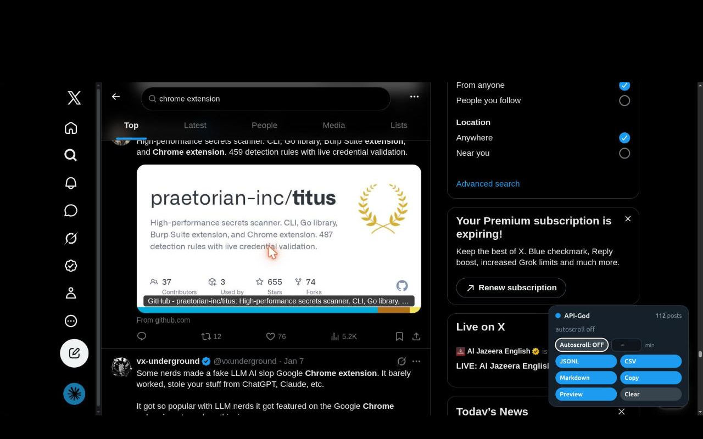
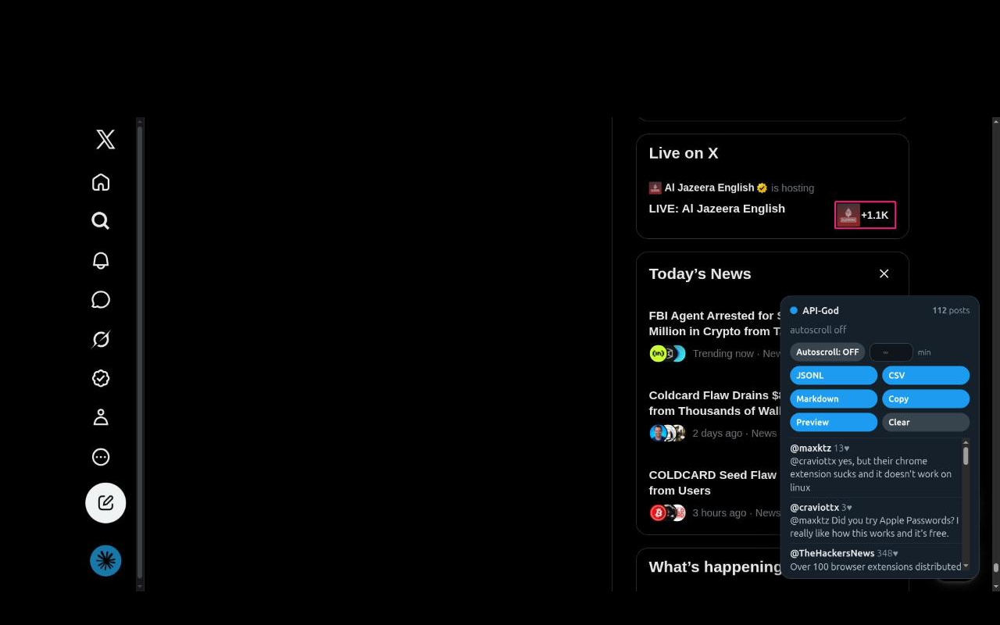

# API-God — X export (Chrome extension)

**It reads the answer to a request the page was going to make anyway.** It doesn't forge
API calls, doesn't scrape rendered HTML. X makes the authenticated request; the extension
tees the JSON response.

## What it is

A Chrome extension that turns your already-logged-in X tab into a local export tool.
When you search or scroll, X's own JavaScript calls its internal GraphQL backend and
renders the JSON; the extension reads those response bodies in the page and exports them
to JSONL, CSV, or markdown. You never authenticate to anything — it runs inside the tab
you already signed into.

## Why that matters

Reading X's own response — instead of forging requests or parsing rendered HTML — is the
one property that separates it from a DOM scraper:

| Compared to | They do | This does instead |
|---|---|---|
| **DOM scrapers / Nitter** | Parse rendered HTML; race the paint; break on UI redesigns; run on a third-party server | Reads the structured JSON X itself fetched — captures `followers / blue / views / quotes` the rendered page omits; survives UI redesigns; stays inside your own session |

## How it works

X is a single-page app — open a search or profile and it runs a GraphQL query
(`SearchTimeline`, `UserTweets`, `ListLatestTweetsTimeline`, `HomeTimeline`, …) and
renders the JSON. The extension reads the answer to a request the page makes anyway:

```
X's JS fires SearchTimeline ─► patched fetch/XHR tees the response ─► parse ─► JSONL / CSV / markdown
```

- `inject.js` (page main world) patches `window.fetch` + `XMLHttpRequest` to tee the
  GraphQL **response bodies** — MV3 removed blocking-`webRequest` body access, so this is
  how you read them. It never forges a request; X makes the authenticated call, the
  extension reads the result.
- `content.js` (isolated world) parses X's timeline JSON into flat records (parser
  parity-tested byte-for-byte against a reference implementation), dedupes by tweet id,
  and exports.

Per record: `id, handle, name, text, time, url, likes, replies, reposts, followers, blue,
verified, views, quotes, lang, is_retweet, source`.

## Install (unpacked)

1. `chrome://extensions` → enable **Developer mode**
2. **Load unpacked** → select this folder
3. Open [x.com](https://x.com) logged in — an **API-God** panel appears bottom-right
4. Search or scroll; the counter climbs as responses land. **Preview** shows what's
   captured so far. Save with **JSONL**, **CSV**, or **Markdown**, or **Copy** the JSONL
   to the clipboard.

### Autoscroll (optional, off by default)

Flip **Autoscroll: ON** and the panel jumps to the bottom of the page about once a second
so X keeps loading the next page — each hit pulls in a whole page of posts. The extension
still fetches nothing itself. Set a **minutes** value next to the toggle to stop after a fixed
time (a live countdown shows in the panel); leave it blank to run until the timeline runs
dry. Either way it stops on its own once no new posts arrive. Leaving it running is
automated pagination; whether that fits your use of X is the operator's call (see
**Scope**).

### Preview, filter, and search

**Preview** opens a live pane of what you've captured. Type in its box to **filter** the
captured set (matches handle, name, or text); press **Enter** or **Go X** to run that text
as a search on X instead. Running it on X is a full navigation on purpose — it reloads the
page so `inject.js` re-patches `fetch` at `document_start` before X's bundle grabs its own
reference, which is the cleanest capture path.

### Parlay (optional)

**Parlay** runs a chain of searches back-to-back, each for a duration you set — e.g.
`cats` for 1 min, then `dogs` for 3 min, then `birds` for 5 min. Add legs (term +
minutes), press **Start parlay**, and it navigates to each search in turn, autoscrolls for
that leg's minutes, and moves on; every leg's posts accumulate into one deduped set you
export at the end. Because each leg reloads the page, the plan and the captured records are
parked in the page's own `sessionStorage` (a standard web API, x.com-scoped, local only, no
extra permission) so they survive the reloads; the run is discarded on **Stop parlay**,
**Clear**, or closing the tab. Like autoscroll, a parlay is automated pagination — the
operator's call (see **Scope**).

## Screenshots





Web Store listing assets (1280×800 screenshots + 128×128 icon) live in [`store/`](store/).

## Scope

Runs under your own account and session, over your own view — the same posts the page
already showed you. No firehose, no full-archive, no key: it's bounded to what your
session can see, at browsing speed. Automated/bulk access to X's internal endpoints can
violate X's terms and risk the account; that call is the operator's. Capture and export
only — it makes no network calls of its own.

## License

MIT © 2026
